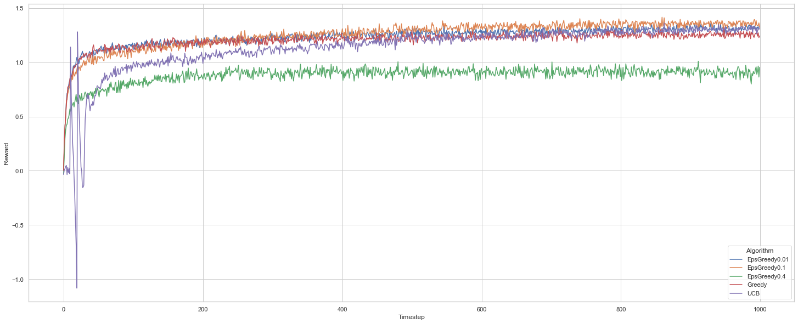
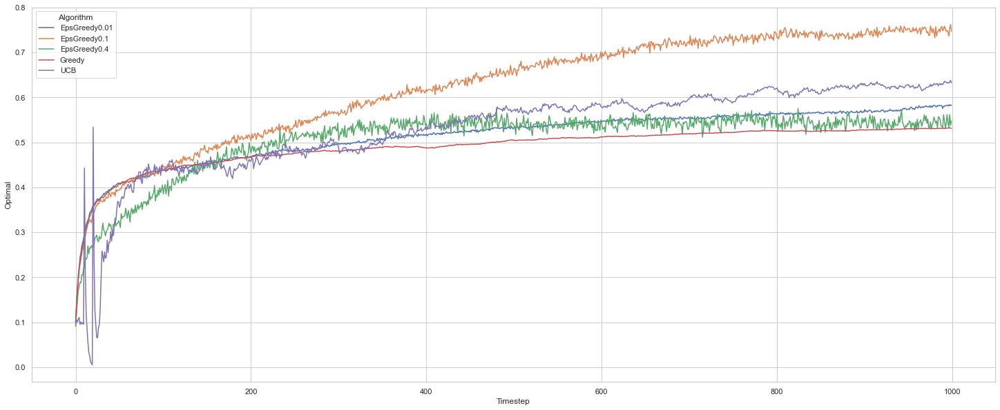

# All Things RL 

`agents.py` : simple versions of some RL agent algorithms

`environments.py` : Test environments to run these algorithms (so far only k-Armed Bandits though)

<figure>
  
  <figcaption>Rewards on a 10-Armed Bandits env per agent</figcaption>
</figure>

<figure>
  
  <figcaption>Pct of Optimal Behaviour selection on a 10-Armed Bandits env per agent</figcaption>
</figure>

Sorry, that's all the docs there are, I leave you now with Jabberwocky, by Lewis Carroll:

>’Twas brillig, and the slithy toves 
>      Did gyre and gimble in the wabe: 
>All mimsy were the borogoves, 
>      And the mome raths outgrabe. 

>“Beware the Jabberwock, my son! 
>      The jaws that bite, the claws that catch! 
>Beware the Jubjub bird, and shun 
>      The frumious Bandersnatch!” 

>He took his vorpal sword in hand; 
>      Long time the manxome foe he sought— 
>So rested he by the Tumtum tree 
>      And stood awhile in thought. 

>And, as in uffish thought he stood, 
>      The Jabberwock, with eyes of flame, 
>Came whiffling through the tulgey wood, 
>      And burbled as it came! 

>One, two! One, two! And through and through 
>      The vorpal blade went snicker-snack! 
>He left it dead, and with its head 
>      He went galumphing back. 

>“And hast thou slain the Jabberwock? 
>      Come to my arms, my beamish boy! 
>O frabjous day! Callooh! Callay!” 
>      He chortled in his joy. 

>’Twas brillig, and the slithy toves 
>      Did gyre and gimble in the wabe: 
>All mimsy were the borogoves, 
>      And the mome raths outgrabe. 
